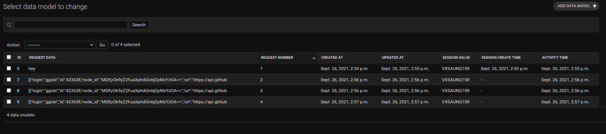

<h1 align="center">Django Session</h1>

<p align="center">Django Maintain session internally, 
we just need to mend the code as per our use case. Lets use django session 
internal service to achieve the below mentioned tasks </p>

## Links 👐
Some Resources to learn more about django sessions on the go
- [Tutorial Point](https://www.tutorialspoint.com/django/django_sessions.htm "Learn")

- [Django Session Repo](https://github.com/karamdeeps/DjangoSession/tree/main "Live View")

- [Bugs In Project](https://github.com/karamdeeps/DjangoSession/issues "Issues Page")

- [Data API](http://localhost:8000/api/data/ "Data API")

- [Session API](http://localhost:8000/api/session/ "Session API")

## Screenshots 🤳




## How To! 🦹🏻

In the project directory, you can run:
```
    # This command will create the db, you just have to provide the password
    python manage.py createdb
    
    # This will create the schema files inside migration folder
    python manage.py makemigrations
    
    # This command will execute all the changes in db
    python manage.py migrate
    
    # Run the server to check if everything works fine or not
    python manage.py runserver 
```

## Built With 🤖

- Python
- Django


## Author 🧐

* **Karamdeep Singh**
  * [Profile](https://github.com/karamdeeps "Karamdeeps")
  * [Email](mailto:karamdeepsinghk.ksk@gmail.com?subject=Query "Questions!")
  * [LinkedIn](https://www.linkedin.com/in/karamdeep-singh-a0908b104/ "LinkedIn")
  * [StackOverFlow](https://stackoverflow.com/users/7357716/karamdeep-singh?tab=profile "StackOverFlow")

## 🤝 Support

Contributions, issues, and feature requests are welcome!

Give a ⭐️ if you like this project!
